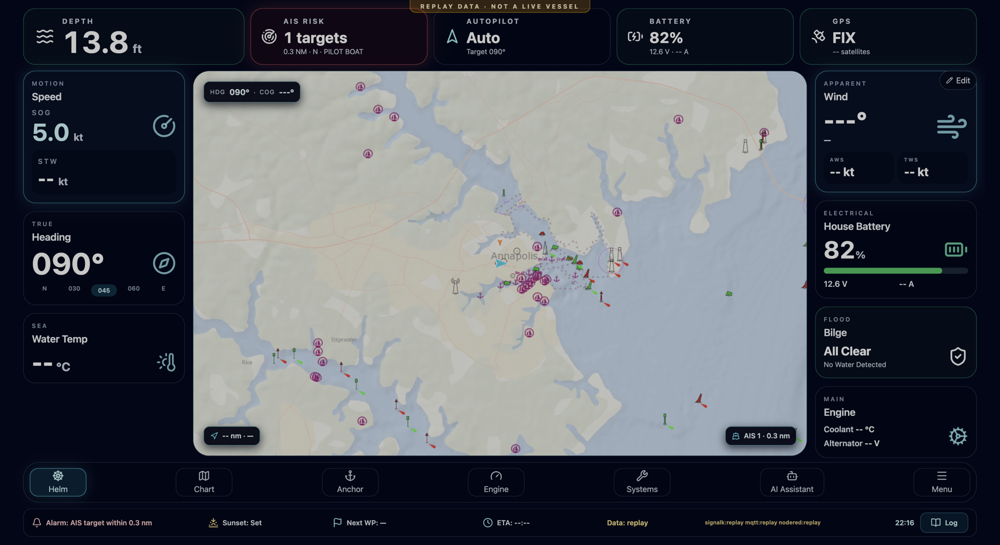
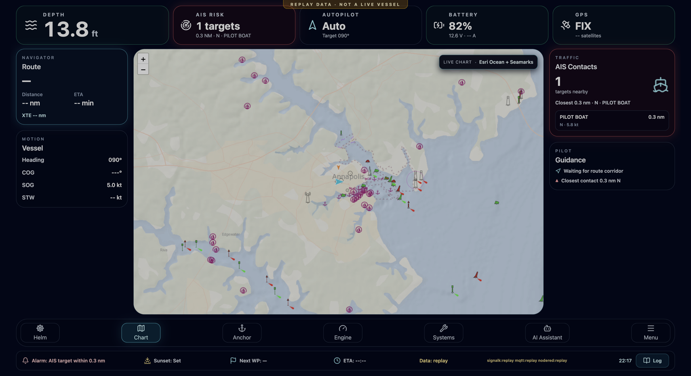
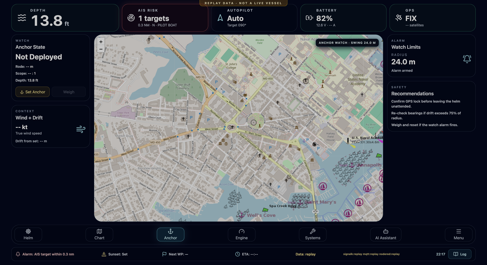
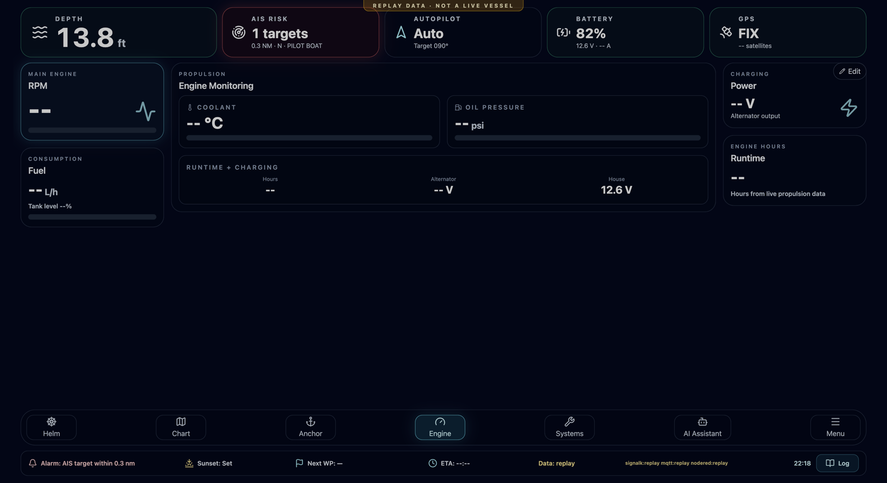
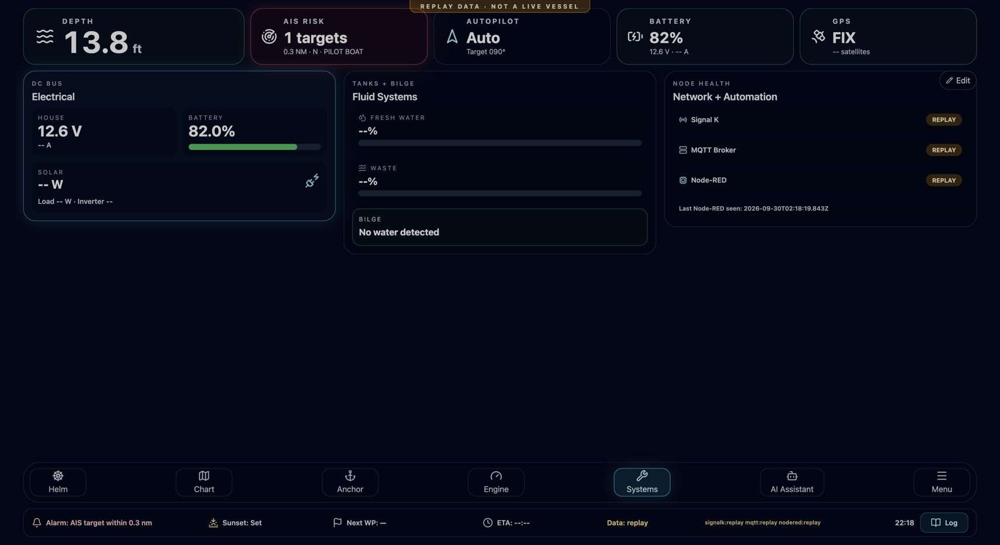
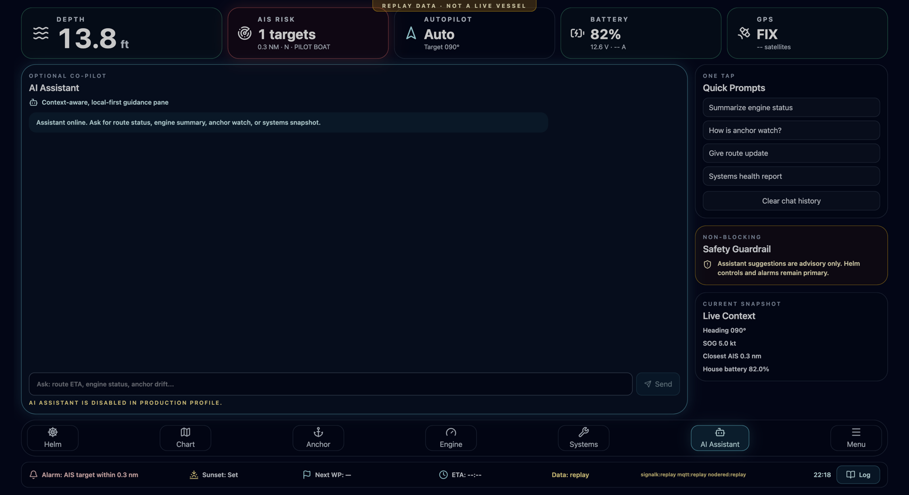
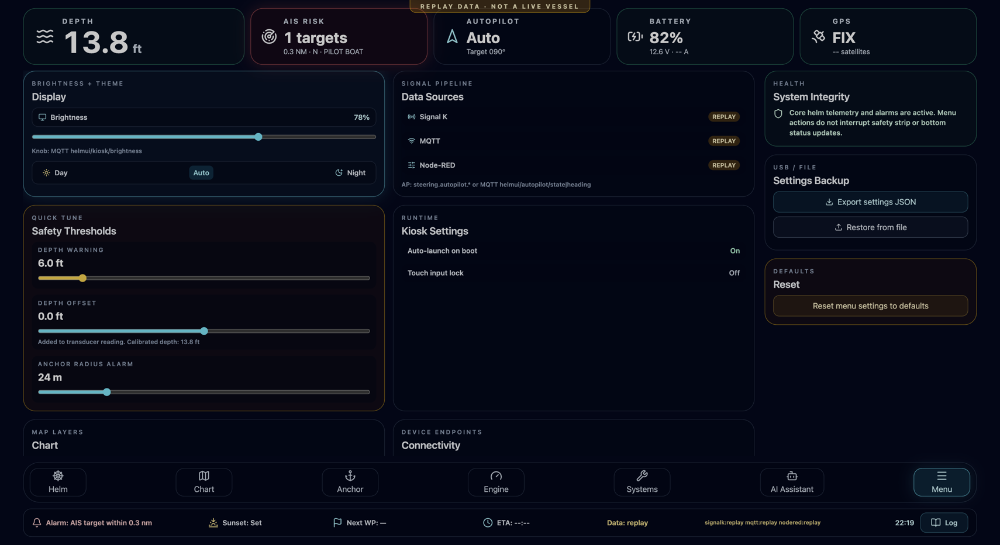
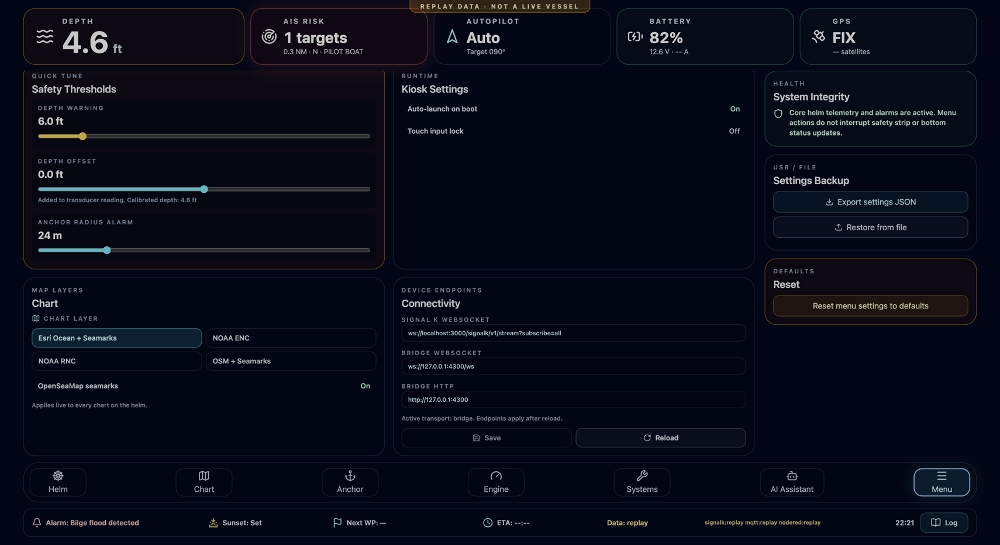
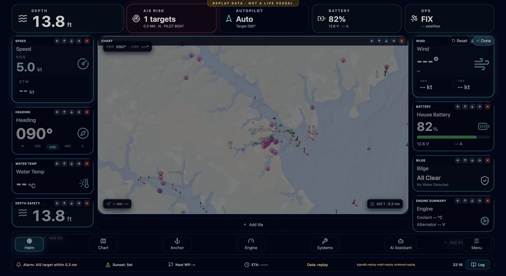

# HelmUI

**A modern, touch-first helm dashboard for OpenPlotter / Signal K boats.**

HelmUI is a fullscreen browser/PWA cockpit for a Raspberry Pi 5 running OpenPlotter and the wider open-source marine stack. It puts your live boat data — position, depth, wind, engine, batteries, tanks, AIS, autopilot — on one calm, glanceable, glove-friendly screen at the helm.

It is **not** a replacement for OpenPlotter, Signal K, OpenCPN, Node-RED, MQTT, AIS-catcher, or Pypilot. It sits on top of them as the display and interaction layer.



> All screenshots below are from the built-in **benchtop replay mode** (hence the amber "Replay data — not a live vessel" banner). On a real boat that banner disappears and every value comes straight from your vessel.

---

## Table of contents

- [Why HelmUI](#why-helmui)
- [Screens](#screens)
- [In-app customization](#in-app-customization)
- [How it fits your boat (architecture)](#how-it-fits-your-boat-architecture)
- [Safety-first design](#safety-first-design)
- [Requirements](#requirements)
- [Quick start (try it on your laptop)](#quick-start-try-it-on-your-laptop)
- [Install on a Raspberry Pi](#install-on-a-raspberry-pi)
- [Configuration reference](#configuration-reference)
- [Development](#development)
- [Bridge API](#bridge-api)
- [Roadmap](#roadmap)
- [Feedback & community](#feedback--community)
- [Safety notice](#safety-notice)

---

## Why HelmUI

Most open-source marine software is powerful but built for tablets, laptops, or configuration screens — not for a bright cockpit and wet hands. HelmUI focuses on the *helm experience*:

- **Touch-first & glanceable** — big numbers, high-contrast cards, designed at 1920×1080 and auto-scaled to any screen.
- **Live data only** — no faked demo values on your boat. If a sensor is silent, the field shows `--` instead of inventing a number.
- **One calm surface** — a persistent safety strip and status bar stay visible while you move between Helm, Chart, Anchor, Engine, Systems, and Menu.
- **Customizable in place** — change the chart, retune thresholds, and rearrange the dashboard from the touchscreen, no redeploy.
- **Kiosk-ready** — boots straight into fullscreen Chromium on a Raspberry Pi 5.

---

## Screens

### Helm
The default cockpit view: speed, heading, water temperature, wind, batteries, bilge, and an engine glance around a live moving chart with your vessel and nearby AIS targets.


### Chart
A larger nautical chart with route, vessel motion, and an AIS contact list. The chart layer is selectable (see [customization](#in-app-customization)) and falls back gracefully to a readable street base wherever chart coverage is missing.



### Anchor
An anchor-watch view with swing radius, drift from set point, wind, and a detailed close-in chart. Set the anchor when you have a GPS fix and HelmUI arms the watch.



### Engine
Propulsion at a glance: RPM, fuel burn and tank level, coolant, oil pressure, runtime hours, and alternator/charging.



### Systems
House systems health: DC bus and solar, fresh/waste tanks, bilge state, and the connectivity health of every data source (Signal K, MQTT, Node-RED).



### AI Assistant (optional)
An optional, context-aware co-pilot pane for plain-language summaries ("summarize engine status", "how is anchor watch?"). It is **advisory only** and is disabled by policy in the production profile — helm controls and alarms always remain primary.



### Menu / Settings
Display brightness and theme, data-source health, safety thresholds (depth warning, depth offset, anchor radius), kiosk options, chart and connectivity settings, and settings backup/restore.



---

## In-app customization

Everything below can be changed on the touchscreen and persists across restarts — no config files, no redeploy.

### Chart & connectivity settings

- **Chart layer** — switch between **Esri Ocean + Seamarks**, **NOAA ENC**, **NOAA RNC**, and **OSM + Seamarks**. The map updates live.
- **Seamarks** — toggle the OpenSeaMap seamark overlay on or off.
- **Device endpoints** — view and edit the Signal K WebSocket, bridge WebSocket, and bridge HTTP URLs from the helm. Saved endpoints are layered over the build defaults and take effect on the next reload (a **Reload** button is right there).



### Editable dashboards

Tap **Edit** (or **press-and-hold** the dashboard) to enter edit mode on the Helm, Engine, or Systems screens. Then:

- **Move** tiles up/down within a column or left/right between columns
- **Remove** any tile
- **Add** tiles from a picker of available instruments (GPS, depth safety, AIS risk, autopilot, engine/electrical/fluid panels, and more)
- **Reset** a screen back to its default layout, or tap **Done** to exit

Your layout is saved per screen and restored on the next boot.



---

## How it fits your boat (architecture)

HelmUI reads a single **canonical boat-data model** and renders it. That model is fed by one of two transports:

```
                    ┌─────────────────────────────────────────┐
   NMEA 2000 /      │              Signal K server            │
   0183 / sensors ─▶│  (navigation, environment, propulsion,  │
   GPS, AIS, BMS    │   electrical, steering.autopilot, …)    │
                    └───────────────┬─────────────────────────┘
                                    │  Signal K deltas (WS)
             ┌──────────────────────┴───────────────────────┐
             ▼                                               ▼
   ┌───────────────────┐   staging-live            ┌───────────────────────┐
   │  Direct client    │◀──────────────────────────│      HelmUI (PWA)     │
   │  (Signal K only)  │                            │  React + Vite + TS    │
   └───────────────────┘                            │  Zustand store,       │
                                                     │  Leaflet chart        │
   ┌───────────────────────────────┐  production-   └───────────┬───────────┘
   │       HelmUI bridge           │  live (WS)                 ▲
   │  Signal K + MQTT + Node-RED  │────────────────────────────┘
   │  normalized to one stream     │
   └───────────────────────────────┘
             ▲            ▲
        MQTT │            │ Node-RED status / brightness knob / autopilot
   (brightness, autopilot topics, etc.)
```

- **`staging-live`** — HelmUI connects **directly to Signal K** over WebSocket. Simplest setup; Signal K paths only.
- **`production-live`** — HelmUI connects to the bundled **bridge** (`backend/bridge/server.mjs`), which merges **Signal K + MQTT + Node-RED** into one normalized telemetry stream and exposes health endpoints. Recommended for a real install where you also drive a physical brightness knob or autopilot via MQTT/Node-RED.

Only `mode`, UI settings, saved dashboards, and the anchor radius are persisted locally — **live telemetry is never persisted**, so a restart never shows stale readings as if they were current.

---

## Safety-first design

- **Live-data only.** There is no simulation mode on the boat. Unknown values render as `--` until real telemetry arrives.
- **Honest source status.** The status bar and Systems screen show each source as `online`, `down`, or `n/a` — never a green light for a source that is silent.
- **Replay is clearly marked.** A benchtop **replay** mode can loop a fixture for demos and CI, but it is surfaced end-to-end (banner + `Data: replay` + `signalk:replay`) so replayed data can never be mistaken for a live vessel.
- **Persistent alarms.** Depth, bilge flood, anchor drift, and source-disconnect conditions are evaluated on a fixed cadence even if the stream goes quiet.

---

## Requirements

**Target (production):**
- Raspberry Pi 5 (4 GB+), 64-bit Raspberry Pi OS or an OpenPlotter image
- A calibrated touchscreen and stable marine-grade power
- A reachable Signal K server (and, for the bridge path, an MQTT broker and optional Node-RED)

**Development (any machine):**
- Node.js 20 LTS or newer
- A modern browser (Chromium/Chrome recommended for kiosk parity)

---

## Quick start (try it on your laptop)

You don't need a boat to see HelmUI — it ships with a looping demo fixture.

```bash
# 1) Install
npm install

# 2) In one terminal, start the bridge in replay mode
npm run bridge:replay

# 3) In another terminal, start the UI against the bridge
VITE_RUNTIME_PROFILE=production-live \
VITE_TELEMETRY_TRANSPORT=bridge \
VITE_TELEMETRY_BRIDGE_WS_URL='ws://127.0.0.1:4300/ws' \
VITE_TELEMETRY_BRIDGE_HTTP_URL='http://127.0.0.1:4300' \
VITE_SIGNALK_ENABLED=false \
VITE_AI_ASSISTANT_ENABLED=false \
npm run dev
```

Open the printed URL (usually <http://localhost:5173>). You'll see the replay banner and live-looking data for a boat off Annapolis, including a nearby AIS "PILOT BOAT", a depth alarm, and a bilge flood/recover cycle. On macOS Chrome, `Control + Command + F` gives you fullscreen.

To connect to a **real Signal K server** instead:

```bash
VITE_RUNTIME_PROFILE=staging-live \
VITE_TELEMETRY_TRANSPORT=signalk \
VITE_SIGNALK_ENABLED=true \
VITE_SIGNALK_WS_URL='ws://<signalk-host>:3000/signalk/v1/stream?subscribe=all' \
npm run dev
```

---

## Install on a Raspberry Pi

A complete, production-style walkthrough — Node setup, `.env` configuration, `systemd` services for the bridge and web runtime, health checks, kiosk autostart, updating, and emergency "get the desktop back" recovery — lives in:

**➡️ [docs/raspberry-pi-install.md](docs/raspberry-pi-install.md)**

The short version:

```bash
# On the Pi
sudo apt update && sudo apt install -y git curl chromium-browser
curl -fsSL https://deb.nodesource.com/setup_20.x | sudo -E bash - && sudo apt install -y nodejs

git clone <YOUR_REPO_URL> /opt/helmui
cd /opt/helmui
npm install
cp .env.production.example .env.production   # edit hosts/ports for your boat
npm run build

# Install + start the bridge and web services, then wire the kiosk
sudo ./scripts/install-systemd.sh pi /opt/helmui
./scripts/start-kiosk.sh http://127.0.0.1:4173
```

> ⚠️ When configuring kiosk autostart, keep your desktop's panel/wallpaper entries **in addition to** the kiosk line, so exiting the kiosk drops you back to a usable desktop rather than a black screen. The install guide explains this and includes an SSH/TTY recovery section.

Helper scripts: [`scripts/start-kiosk.sh`](scripts/start-kiosk.sh), [`scripts/stop-kiosk.sh`](scripts/stop-kiosk.sh), [`scripts/install-systemd.sh`](scripts/install-systemd.sh), [`scripts/uninstall-systemd.sh`](scripts/uninstall-systemd.sh). Systemd templates live in [`deploy/systemd/`](deploy/systemd/).

---

## Configuration reference

HelmUI is configured with Vite env vars (build/runtime) and the bridge with `BRIDGE_*` env vars. Copy `.env.production.example` to `.env.production` as a starting point.

### Frontend (`VITE_*`)

| Variable | Purpose | Example |
| --- | --- | --- |
| `VITE_RUNTIME_PROFILE` | `staging-live` (direct Signal K) or `production-live` (bridge) | `production-live` |
| `VITE_TELEMETRY_TRANSPORT` | `signalk` or `bridge` | `bridge` |
| `VITE_SIGNALK_ENABLED` | Enable the direct Signal K client | `true` |
| `VITE_SIGNALK_WS_URL` | Signal K stream URL (auto-detected from hostname if unset) | `ws://pi:3000/signalk/v1/stream?subscribe=all` |
| `VITE_TELEMETRY_BRIDGE_WS_URL` | Bridge telemetry WebSocket | `ws://127.0.0.1:4300/ws` |
| `VITE_TELEMETRY_BRIDGE_HTTP_URL` | Bridge health/HTTP base | `http://127.0.0.1:4300` |
| `VITE_CHART_LAYER` | Default chart layer (`esri-ocean`, `noaa-enc`, `noaa-rnc`, `osm`) | `esri-ocean` |
| `VITE_CHART_SEAMARKS` | Default seamark overlay on/off | `true` |
| `VITE_CHART_OFFLINE_ONLY` | Use only a local offline tile template | `false` |
| `VITE_CHART_TILE_URL_TEMPLATE` | Offline/base tile template | `/tiles/base.svg` |
| `VITE_AI_ASSISTANT_ENABLED` | Enable the AI pane (forced off in production) | `false` |

> Chart layer, seamarks, and the connection endpoints can also be changed **in-app** (see [customization](#in-app-customization)); those saved values override the build defaults on the next reload.

### Bridge (`BRIDGE_*`)

| Variable | Purpose | Example |
| --- | --- | --- |
| `BRIDGE_PORT` / `BRIDGE_HOST` | Bind address for the bridge | `4300` / `127.0.0.1` |
| `BRIDGE_SIGNALK_WS_URL` | Signal K stream the bridge subscribes to | `ws://127.0.0.1:3000/signalk/v1/stream?subscribe=none` |
| `BRIDGE_MQTT_URL` | MQTT broker URL | `mqtt://127.0.0.1:1883` |
| `BRIDGE_MQTT_BRIGHTNESS_TOPIC` | Physical brightness knob topic | `helmui/kiosk/brightness` |
| `BRIDGE_MQTT_AUTOPILOT_STATE_TOPIC` | Autopilot state topic | `helmui/autopilot/state` |
| `BRIDGE_REPLAY_FILE` | Loop a fixture instead of live sources (**never on the boat**) | `backend/bridge/fixtures/bench-pass.json` |

---

## Development

```bash
npm run dev            # Vite dev server
npm run build          # type-check + production build
npm run preview        # serve the production build locally

npm test               # bridge tests + domain unit tests
npm run smoke:bridge   # bridge smoke check
npm run smoke:replay   # replay smoke check
```

Highlights of the codebase:

- `src/store/boatStore.ts` — Zustand store: canonical `BoatData`, settings, per-screen dashboards, alarms, and persistence.
- `src/domain/` — pure, unit-tested logic (AIS aggregation, alarm evaluation, depth, settings profile, **dashboard layout**).
- `src/components/dashboard/` — the editable tile grid, tile registry, and picker.
- `src/config/runtime.ts` — runtime profile, chart-layer registry, and connectivity resolution.
- `backend/bridge/` — the Node bridge (`server.mjs`), replay player (`replay.mjs`), and fixtures.

The domain and bridge tests run in CI on every push.

---

## Bridge API

The bridge exposes:

- `GET /health` — source and timestamp health (includes `mode`: `live` or `replay`)
- `GET /sources` — source connectivity summary
- `GET /last-seen` — last normalized patch metadata
- `WS /ws` — canonical telemetry stream (`snapshot`, `delta`, `health`)

Pre-departure smoke check:

```bash
curl http://127.0.0.1:4300/health
curl http://127.0.0.1:4300/sources
```

---

## Roadmap

HelmUI is an actively developed MVP. On the near-term list:

- More chart sources and true offline chart packs for coastal cruising
- Drag-and-drop tile moving (in addition to the current move buttons)
- Live endpoint reconnection without a reload
- More instrument tiles and per-tile configuration
- Deeper autopilot and route interaction

Ideas and requests are very welcome — see below.

## Feedback & community

This project is shared with the open marine community for feedback. If you run OpenPlotter/Signal K, I'd love to hear:

- What instruments or screens you'd want at your helm
- How it behaves against your real Signal K/MQTT setup
- Bugs, rough edges, and hardware notes (screens, touch panels, Pi models)

Please open an issue on the repository with your setup and observations.

## Safety notice

HelmUI is an MVP helm **interface**. Do **not** rely on it as your sole safety-critical navigation or monitoring system. Always keep independent, proven navigation instruments and alarms available, and validate every integration against your own vessel before relying on it at sea.
